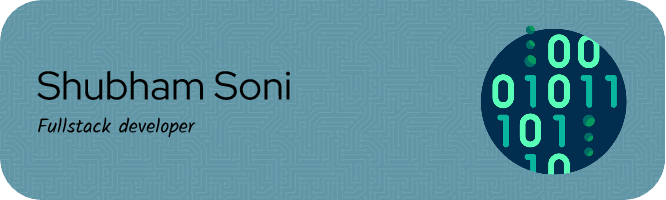

  

# 💫 About Me:
🔭 I’m currently working on Document management system 👯 I’m looking to collaborate on Webdev projects 🌱 I’m currently learning React ⚡ Fun fact I am a mechanical engineer

## 🌐 Socials:
 

# 💻 Tech Stack:
                                         

  

# 📊 GitHub Stats:

---

  ## 💰 You can help me by Donating
    
